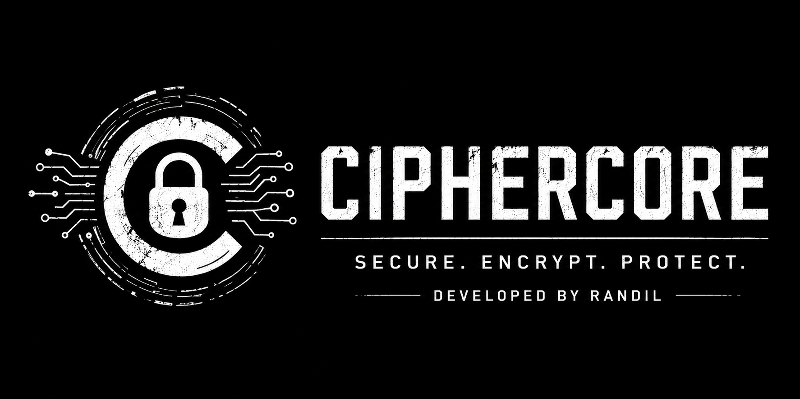

<p align="center">
  
</p>

<h1 align="center">🔐 CipherCore</h1>

<p align="center">
  <b>Secure • Encrypt • Protect</b><br>
  Lightweight password-based encryption toolkit built with Python.
</p>

<p align="center">
  
  
  
</p>

---
CipherCore

A lightweight terminal-based encryption toolkit for securing text and files using strong, password-based cryptographic techniques.

# 📖 Overview

CipherCore is a secure command-line encryption toolkit designed for encrypting and decrypting text and files using modern cryptography standards.

The tool uses:

- PBKDF2-HMAC-SHA256 for secure key derivation
- Fernet authenticated encryption
- Randomized salt generation
- Secure password-based protection

CipherCore is lightweight, beginner-friendly, and built for learning and personal security projects.

---

# ✨ Features

✅ Encrypt text securely  
✅ Decrypt encrypted text  
✅ Encrypt files of any type  
✅ Decrypt encrypted files  
✅ Password-protected encryption  
✅ Random salt generation  
✅ AES-based authenticated encryption  
✅ Interactive CLI interface  
✅ Secure password input with `getpass()`  
✅ Custom terminal banner  

---

# 🛠 Built With

- Python 3
- cryptography
- PBKDF2-HMAC-SHA256
- Fernet Encryption

---

# 📦 Requirements

- Python 3.8 or higher

Install dependencies:

```bash
pip install cryptography
```

---

# 🚀 Installation

## Clone the Repository

```bash
git clone https://github.com/yourusername/ciphercore.git
```

## Navigate Into the Folder

```bash
cd ciphercore
```

## Create Virtual Environment (Recommended)

```bash
python -m venv venv
```

Activate it:

### Windows

```bash
venv\Scripts\activate
```

### Linux / macOS

```bash
source venv/bin/activate
```

---

# 📥 Install Dependencies

```bash
pip install cryptography
```

Or:

```bash
pip install -r requirements.txt
```

---

# ▶️ Running CipherCore

```bash
python CipherCore. py
```

---

# 🖥 Main Menu

```text
==== Encryption Tool ====
1. Encrypt Text
2. Decrypt Text
3. Encrypt File
4. Decrypt File
5. Exit
```

---

# 🔒 Encrypt Text

Choose:

```text
1
```

Enter:

- Password
- Text to encrypt

Example:

```text
Enter password:
Enter text to encrypt: hello world
```

Output:

```text
gAAAAABmEncryptedTextExample...
```

---

# 🔓 Decrypt Text

Choose:

```text
2
```

Enter:

- Password
- Encrypted text

The original message will be restored if the password is correct.

---

# 📁 Encrypt File

Choose:

```text
3
```

Enter the file path:

```text
secret.txt
```

Encrypted output:

```text
secret.txt.enc
```

---

# 📂 Decrypt File

Choose:

```text
4
```

Enter the encrypted file path:

```text
secret.txt.enc
```

The original file will be restored.

---

# 🔐 Security Details

CipherCore uses modern cryptographic practices:

| Feature | Implementation |
|---|---|
| Key Derivation | PBKDF2-HMAC-SHA256 |
| Iterations | 100,000 |
| Salt Size | 16 Bytes |
| Encryption | Fernet |
| Authentication | HMAC |
| Password Input | `getpass()` |

---

# 🧠 How It Works

1. A password is entered by the user.
2. A random salt is generated.
3. PBKDF2 derives a secure encryption key.
4. Fernet encrypts the data securely.
5. The encrypted output includes the salt + ciphertext.

This provides:

- Strong password-based security
- Tamper detection
- Integrity verification
- Protection against brute-force attacks

---

# 📁 Project Structure

```text
ciphercore/
│
├── CipherCore.py
├── banner.jpg
├── README.md
├── requirements.txt
└── LICENSE
```

---

# ⚠ Disclaimer

This project is intended for:

- Educational purposes
- Learning cryptography
- Personal encryption utilities

Do not rely solely on this tool for highly sensitive or enterprise-level security without additional review and testing.

---

# 🔮 Future Improvements

- Command-line arguments
- GUI version
- Multi-file encryption
- Secure file wiping
- Drag-and-drop support
- Configurable encryption settings

---

# 🤝 Contributing

Contributions are welcome.

1. Fork the repository
2. Create a new branch
3. Commit changes
4. Open a Pull Request

---

# 📜 License

MIT License

---

# 👨‍💻 Developer

Developed by **Randil**

---

# ⭐ Support

If you like this project:

- Star the repository
- Share it with others
- Contribute improvements

---